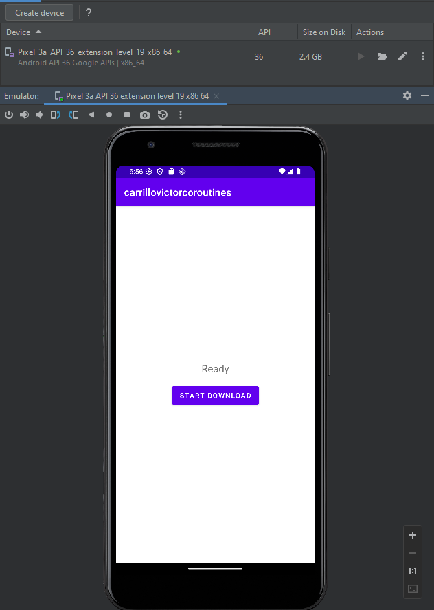
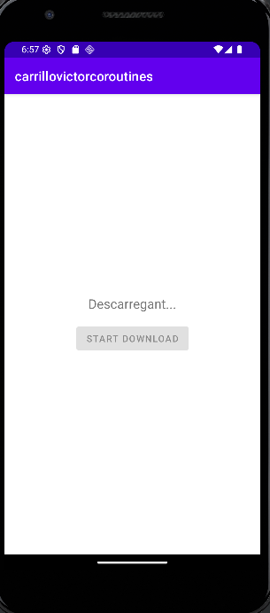
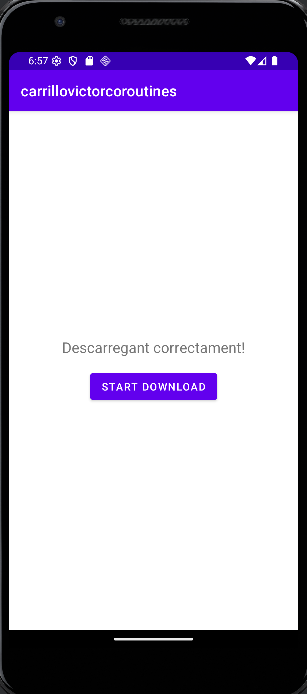

# CarrilloVictorCoroutines

Una aplicació d'Android senzilla que demostra l'ús de les **Coroutines de Kotlin** per gestionar tasques en segon pla i actualitzacions de la interfície d'usuari (UI).

## Descripció

Aquesta aplicació simula un procés de descàrrega per mostrar com es poden utilitzar les coroutines per mantenir la UI fluida mentre s'executen operacions de llarga durada. Utilitza `lifecycleScope` per gestionar el cicle de vida de les coroutines de manera segura dins de l'activitat.

## Característiques Principals

*   **Simulació de Descàrrega:** Utilitza un retard (`delay`) per simular una tasca que consumeix temps.
*   **Gestió del Fil d'Execució:** Utilitza `Dispatchers.IO` per a la tasca simulada i torna al fil principal (`Dispatchers.Main`) per actualitzar la UI.
*   **UI Reactiva:** El botó es desactiva durant el procés i es torna a activar quan finalitza, mostrant missatges d'estat a l'usuari.

## Estats de l'Aplicació

A continuació es mostren els tres estats de l'aplicació durant el procés de descàrrega:

| Ready | Downloading | Downloaded |
| :---: | :---: | :---: |
|  |  |  |

## Tecnologies Utilitzades

*   **Kotlin:** Llenguatge de programació principal.
*   **Android SDK:** Per al desenvolupament de l'aplicació mòbil.
*   **Kotlin Coroutines:** Per a la programació asíncrona.
*   **Lifecycle KTX:** Per a la integració de coroutines amb el cicle de vida d'Android.
*   **ConstraintLayout:** Per al disseny de la interfície d'usuari.

## Estructura del Codi

L'activitat principal es troba a:
`app/src/main/java/com/victor/carrillovictorcoroutines/MainActivity.kt`

El disseny de la UI es troba a:
`app/src/main/res/layout/activity_main.xml`

### Exemple de Codi (Coroutines)

```kotlin
btnDownload.setOnClickListener {
    lifecycleScope.launch {
        tvStatus.text = "Descarregant..."
        btnDownload.isEnabled = false

        withContext(Dispatchers.IO) {
            simulateDownload() // Tasca en segon pla
        }

        tvStatus.text = "Descarregant correctament!"
        btnDownload.isEnabled = true
    }
}
```

## Requisits

*   Android Studio Chipmunk o superior.
*   JDK 1.8.
*   Android API 21+ (Lollipop).

## Com Executar

1.  Clona el repositori o descarrega el codi font.
2.  Obre el projecte amb Android Studio.
3.  Connecta un dispositiu físic o utilitza un emulador.
4.  Fes clic a "Run 'app'".
